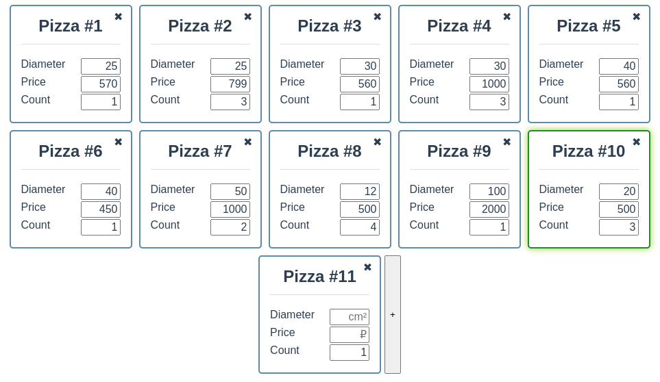

# PizzaCalc

## Project setup
```
npm install
```

### Compiles and hot-reloads for development
```
npm run serve
```

### Compiles and minifies for production
```
npm run build
```

### Lints and fixes files
```
npm run lint
```

### Description 

###### Who loves delicious pizza? And who loves delicious pizza at a delicious price?
 
This project allows you to identify the **most profitable** offer for the sale of **pizza**. 
The price comparison is based on the cost of one square centimeter of pizza. 
The advantages of this project are that you can compare two or more proposals. 
The project will be finalized over time.

.


